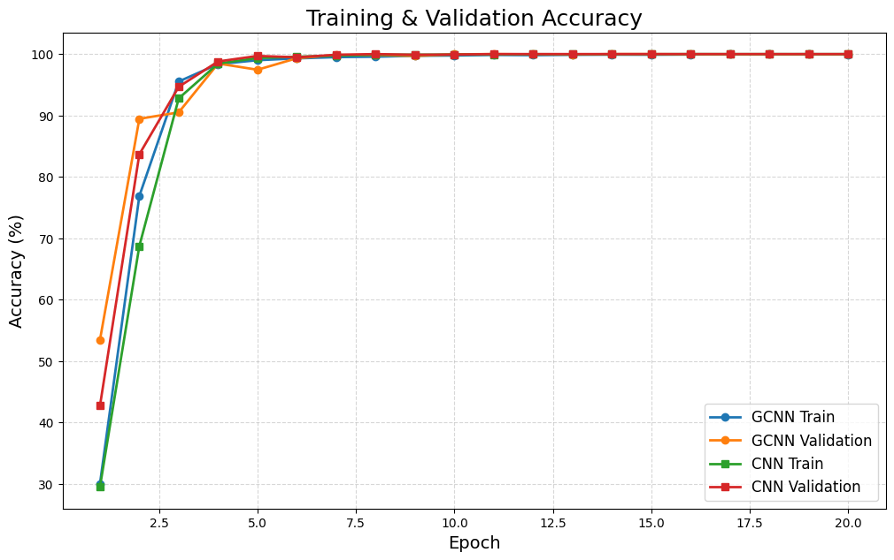
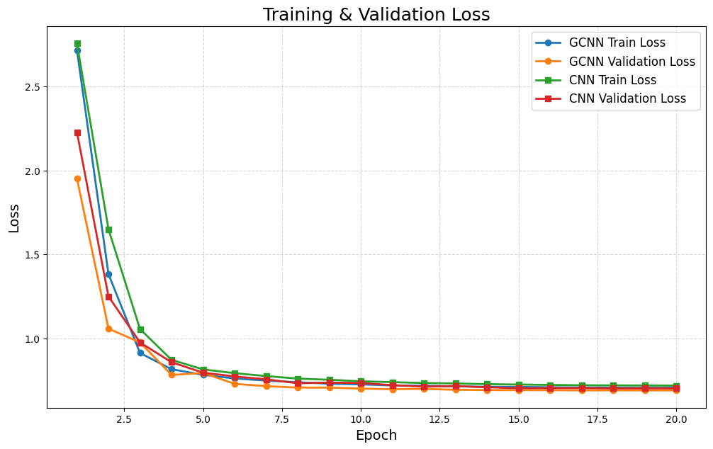
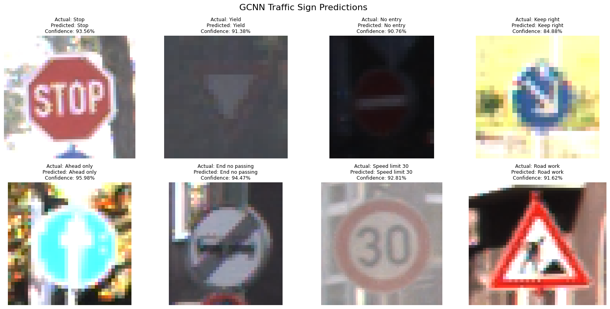

# Traffic Sign Recognition using Group Convolutional Neural Networks

A PyTorch project that recognizes 43 German traffic-sign classes from cropped images and compares a lightweight **GCNN** with a conventional CNN under the same experimental setup.

> This repository performs traffic-sign recognition/classification. It does not locate signs inside complete road scenes.

## Recorded results

Both models were trained for 20 epochs on Google Colab with an NVIDIA Tesla T4 and evaluated on the official GTSRB test split of 12,630 images.

| Metric | Traditional CNN | GCNN |
|---|---:|---:|
| Test accuracy | **98.35%** | 98.16% |
| Macro F1-score | **97.65%** | 96.49% |
| Weighted F1-score | **98.35%** | 98.13% |
| Parameters | 1.138 M | **0.705 M** |
| MACs | 301.08 M | **71.87 M** |
| T4 latency, batch size 1 | **0.769 ms/image** | 2.118 ms/image |
| Best checkpoint epoch | 8 | 11 |

The GCNN reduced parameters by approximately **38.05%** and MACs by approximately **76.13%**, with only a **0.19 percentage-point** reduction in test accuracy.

The standard CNN had lower measured latency on the tested T4 GPU. This is reported honestly: lower theoretical computation does not always guarantee lower wall-clock latency because hardware libraries may optimize standard convolutions more efficiently.

## Training curves





## Sample predictions



## Architecture

The GCNN block uses:

```text
1×1 pointwise convolution
          ↓
3×3 grouped convolution
          ↓
1×1 pointwise convolution
          ↓
optional residual connection
```

Grouped convolution divides channels into groups and reduces spatial-convolution cost. Pointwise convolutions project and mix channel information.

## Dataset

German Traffic Sign Recognition Benchmark (GTSRB):

- 43 classes
- 39,209 original training images before the validation split
- 12,630 official test images
- Variable scale, lighting and viewpoint

The dataset downloads automatically through `torchvision.datasets.GTSRB`.

## Project structure

```text
traffic-sign-gcnn/
├── assets/
├── results/
├── src/
├── benchmark.py
├── config.json
├── evaluate.py
├── plot_history.py
├── predict.py
├── train.py
├── requirements.txt
└── README.md
```

## Install

```bash
python -m venv .venv
```

Windows:

```bash
.venv\Scripts\activate
```

Install dependencies:

```bash
pip install -r requirements.txt
```

## Train

```bash
python train.py --model gcnn --epochs 20
python train.py --model cnn --epochs 20
```

## Evaluate

The model type is read from the saved checkpoint, preventing CNN/GCNN architecture mismatch errors.

```bash
python evaluate.py --checkpoint outputs/best_gcnn.pth
python evaluate.py --checkpoint outputs/best_cnn.pth
```

## Benchmark

```bash
python benchmark.py
```

## Generate training graphs

After both models have been trained:

```bash
python plot_history.py
```

## Predict one image

```bash
python predict.py path/to/sign.ppm --checkpoint outputs/best_gcnn.pth
```

## Key training details

- Input size: 48 × 48
- Optimizer: AdamW
- Loss: cross-entropy with label smoothing
- Scheduler: cosine annealing
- Augmentation: rotation, translation, scale, shear and color jitter
- Best-validation checkpointing
- CPU and CUDA support

## BNN scope

Binary Neural Networks are relevant motivation because binarized weights and activations can reduce memory and arithmetic. They were not included in the measured experiment because a fair comparison requires a separate BNN implementation and hardware-aware benchmark. The experimental comparison here is strictly **CNN versus GCNN**.

## Limitations

- Cropped-sign classification only, not road-scene detection.
- Random train/validation splitting may place visually related samples in both subsets.
- Latency depends on device, framework, batch size and optimized kernels.
- Model checkpoints are excluded from Git; reproduce them using `train.py`.

## Resume-ready points

- Built a 43-class GTSRB traffic-sign recognition system using PyTorch and grouped convolutions.
- Reduced parameters by approximately 38% and MACs by approximately 76% compared with a conventional CNN.
- Achieved 98.16% GCNN test accuracy versus 98.35% for the CNN baseline.
- Implemented training, augmentation, checkpointing, evaluation, inference, benchmarking and visual result reporting.

## Author

**Rithik Reddy Sandhadi**
